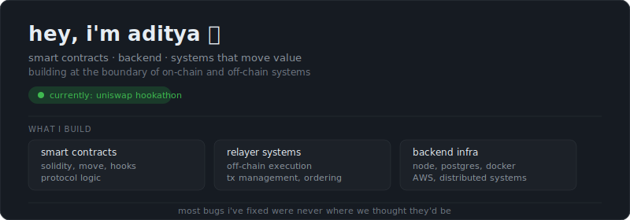

<table>
<tr>

<td width="50%" valign="top" align="left">
<h1>how i work</h1>

i build and debug systems that span contracts, backend services, and infra.
most problems i care about don’t live in one place — they emerge from how
components interact under real conditions.

i approach debugging as a tracing problem:
follow the data, understand the assumptions, and map where things diverge.
that usually means going across layers — not staying inside one abstraction.

i optimize for:

<ul>
  <li>understanding over quick fixes</li>
  <li>end-to-end visibility</li>
  <li>systems that behave predictably under stress</li>
</ul>

i’m most useful when things are unclear, interconnected, or breaking in ways
that aren’t immediately obvious.

</td>
<td width="38%" valign="top" align="right">

</td>
</tr>
</table>

---

### preferred stack

**on-chain**

**backend & infra**

---

### reach out

if you're building something interesting —

